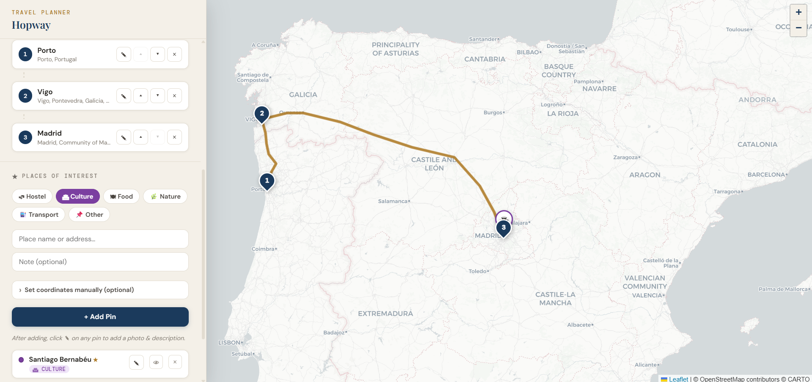
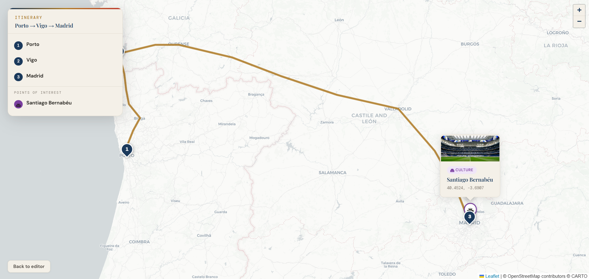
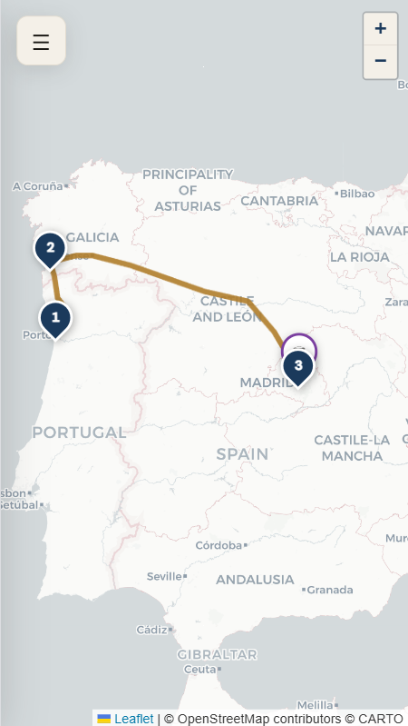

# Hopway

A lightweight travel route explorer focused on visual trip planning, interactive maps, and shareable journeys.



## Live Demo

🌐 https://danieljvsa.github.io/hopway/

---

## Overview

Hopway is a map-first travel planning application designed to help users visually create, explore, and share routes between destinations.

The project focuses on simplicity, speed, and accessibility while providing an enjoyable travel-planning experience directly in the browser.

The idea started as an experiment around:

- Visual route planning
- Interactive maps
- Lightweight frontend architecture
- AI-assisted rapid prototyping
- Shareable travel experiences

---

## Features

- 🗺️ Interactive map-first interface
- 📍 Multi-destination route planning
- 🚆 Route visualization
- ✈️ Travel exploration experience
- 🔗 Shareable routes
- ⚡ Lightweight static frontend
- 📱 Responsive design
- 🌍 CARTO map integration
- 🤖 AI-assisted route generation ideas

---

## Tech Stack

- HTML5
- CSS3
- JavaScript
- CARTO Maps
- GitHub Pages

---

## AI-Assisted Development

This project was developed with the help of:

- Claude AI
- OpenCode AI
- DeepSeek V4 Flash
- Qwen 3.6 Plus

AI was mainly used for:

- UI experimentation
- Feature ideation
- Rapid prototyping
- Architecture discussions
- Development acceleration
- Iterative improvements

---

## Why I Built This

I wanted to experiment with creating a lightweight and visual travel-planning tool that focuses more on exploration and user experience than traditional route planners.

Many existing travel tools are:

- Too complex
- Heavy and slow
- Overloaded with features
- Not visually engaging

Hopway was built to explore how quickly modern MVPs can be developed using AI-assisted workflows while still maintaining human control over architecture, UX, and product direction.

It also became a way to improve my frontend and product-thinking skills alongside my backend engineering background.

---

## Project Goals

The main objectives for Hopway were:

- Create a map-first experience
- Keep the application lightweight
- Enable route sharing
- Provide an enjoyable UX
- Experiment with AI-assisted development workflows

---

## Architecture

The project follows a lightweight frontend-first architecture:

```text
Browser
   ↓
Static Frontend (HTML/CSS/JS)
   ↓
Map & Routing Services
```

No backend infrastructure is currently required.

---

## Running Locally

Clone the repository:

```bash
git clone https://github.com/danieljvsa/hopway.git
```

Open the project folder:

```bash
cd hopway
```

Run locally using a simple server:

```bash
python -m http.server 8080
```

Or use VSCode Live Server.

---

## Deployment

The project is deployed using GitHub Pages.

To deploy:

1. Push changes to the repository
2. Enable GitHub Pages
3. Select the main branch
4. Publish

---

## Roadmap

- [ ] Smarter route generation
- [ ] AI-generated travel itineraries
- [ ] Save favorite routes
- [ ] Public shared route pages
- [ ] Better mobile experience
- [ ] Travel duration estimation
- [ ] Train and metro route integration
- [ ] Offline support
- [ ] Collaborative route planning

---

## Screenshots

### Main Map View



### Route Planning


### Mobile View



---

## Built With AI Assistance

This project was developed with AI-assisted workflows using Claude AI, OpenCode, DeepSeek and Qwen models for rapid prototyping, iteration, debugging, and development acceleration.

AI did not replace engineering decisions or product direction — it accelerated experimentation, reduced friction, and improved iteration speed.

---

## Author

Daniel Sá

- Portfolio: https://danieljvsa.vercel.app/
- GitHub: https://github.com/danieljvsa

---

## License

MIT License
